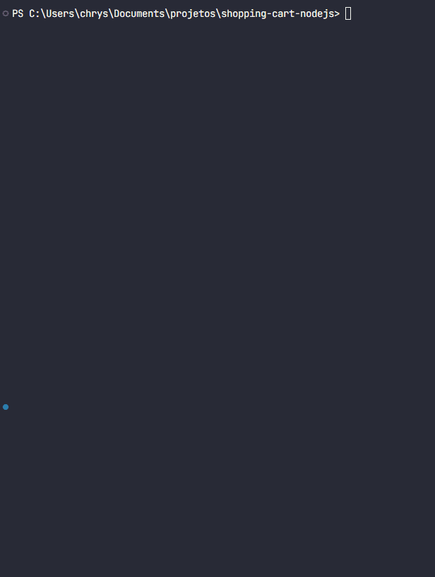

<h1 align="center"> Shopping Cart Node.JS </h1>

  
  <a href="#-screenshots">Screenshots</a>&nbsp;&nbsp;&nbsp;|&nbsp;&nbsp;&nbsp;
  <a href="#-technologies">Technologies</a>&nbsp;&nbsp;&nbsp;|&nbsp;&nbsp;&nbsp;
  <a href="#-features">Features</a>&nbsp;&nbsp;&nbsp;|&nbsp;&nbsp;&nbsp;
  <a href="#-project">Project</a>&nbsp;&nbsp;&nbsp;|&nbsp;&nbsp;&nbsp;
  <a href="#-license">License</a>&nbsp;&nbsp;&nbsp;|&nbsp;&nbsp;&nbsp;
  <a href="#-contributing">Contributing</a>&nbsp;&nbsp;&nbsp;|&nbsp;&nbsp;&nbsp;
  <a href="#support">Support</a>  

  

  

 

## 📸 Screenshots

 

## 🛠 Technologies

- NodeJS
- JavaScript
- Git e GitHub
- npm

 

## ✨ Features

- List of items purchased
- Quantity and price
- Total amount

  

## 💻 Project

This is a simple and functional Shopping Cart API built with Node.js. It simulates the core logic behind an e-commerce shopping cart.

 

## 📜 License

* This project is licensed under the [MIT License](https://choosealicense.com/licenses/mit/)

 

## 🫱🏻‍🫲🏻 Contributing

 Contributions, issues, and feature requests are welcome! Please, feel free to do it! 😉 

 
